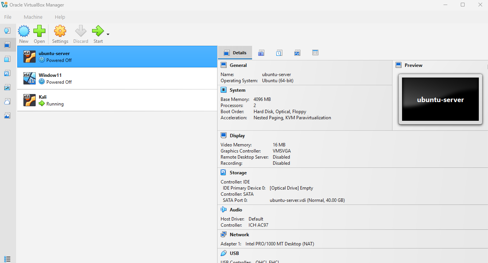
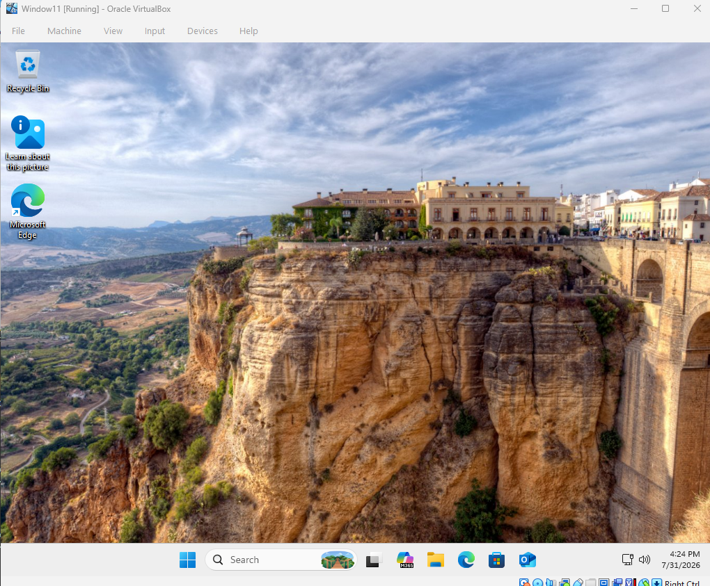
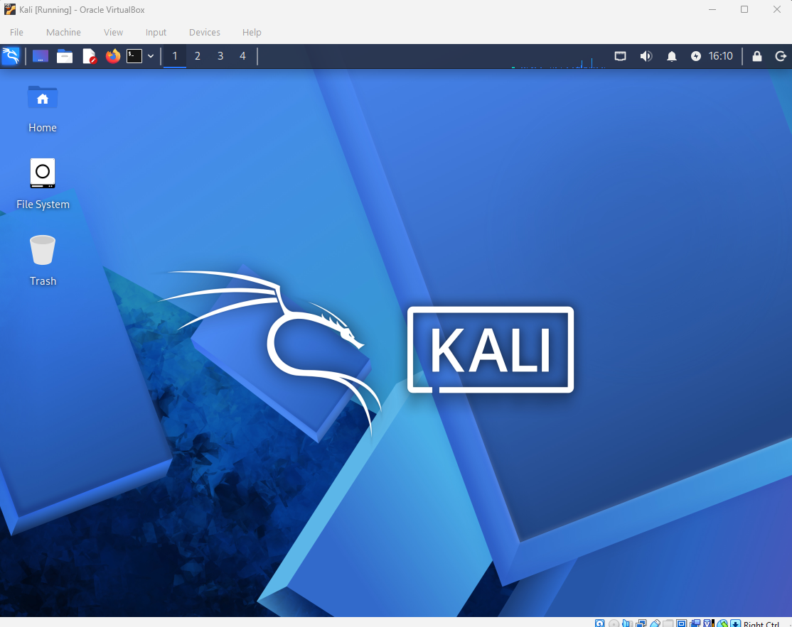
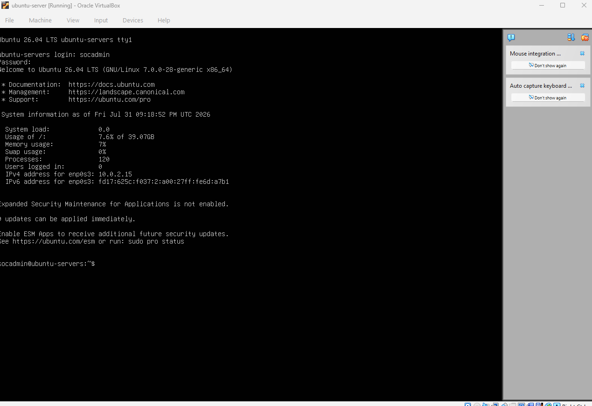

# 🛡️ Home SOC Lab

## Overview

This project documents my Home Security Operations Center (SOC) built in VirtualBox for hands-on cybersecurity training.

---

## Lab Environment

### Host Machine

- Windows 11 Pro

### Hypervisor

- Oracle VirtualBox

### Virtual Machines

- Windows 11 (Target)
- Kali Linux (Attacker)
- Ubuntu Server (SIEM)

---

# Phase 1 – Environment Setup ✅

## Objectives

- Install VirtualBox
- Create three virtual machines
- Verify each machine boots successfully

## Screenshots

### VirtualBox

### Windows 11

### Kali Linux

### Ubuntu

---

## Skills Learned

- Virtualization
- Operating System Installation
- VM Configuration
- Basic Network Planning

---

## Next Phase

- Configure networking
- Install Sysmon
- Install Splunk
- Forward Windows logs
- Simulate attacks from Kali
- Detect attacks in Splunk
